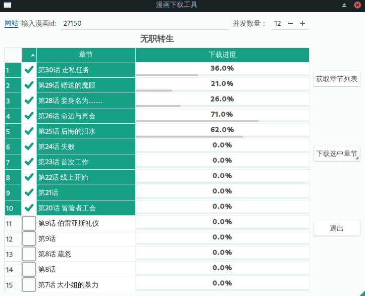

# 简介
　　漫画下载工具，支持多线程

# 安装
　　下载整个项目，然后
```sh 
pip install -r requirements.txt
```
   
   如果不需要使用图形界面，可以不安装pyqt5:
```sh
pip install -r requirements-cli.txt
```

# 执行
   安装完依赖之后，命令行执行
   ```sh 
   hy gui.hy
   ```
   运行主界面
   
   如果使用cli接口，命令行执行
   ```sh 
   hy manhua_get.hy mid
   ```
   先下载章节列表，然后修改章节列表文件，删掉不想下载的章节，再启动命令行下载章节列表文件中指定的章节。

# 程序截图
　
　支持设置线程数量，选择章节，下载进度显示。


# 关于
　 本程序仅用于学习交流，严禁用于商业用途或非法目的。

   Copyright (c) ntestoc3

   
   Licensing: GPL v3
